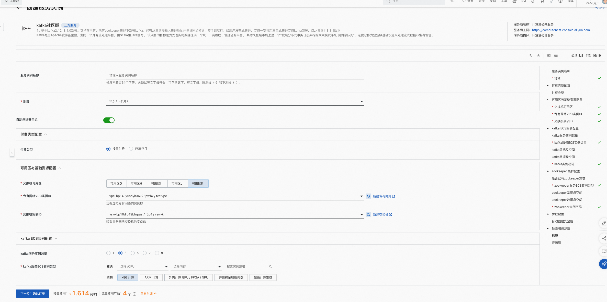
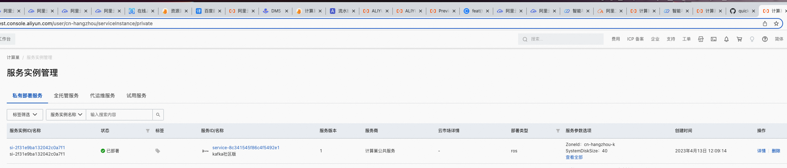
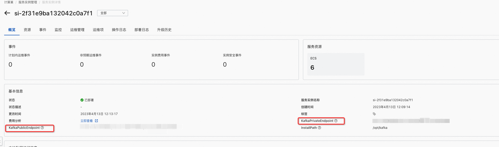

# kafka社区版服务实例部署文档

## 概述

Kafka是由Apache软件基金会开发的一个开源流处理平台，由Scala和Java编写。
该项目的目标是为处理实时数据提供一个统一、高吞吐、低延迟的平台。
其持久化层本质上是一个“按照分布式事务日志架构的大规模发布/订阅消息队列”，这使它作为企业级基础设施来处理流式数据非常有价值。

## 计费说明

Kafka社区版在计算巢上的费用主要涉及：

Kafka集群:
- 所选vCPU与内存规格
- 磁盘容量
- 机器数量

Zookeeper集群（如需要与Kafka同步部署）:
- 所选vCPU与内存规格
- 磁盘容量

计费方式包括：
- 按量付费（小时）
- 包年包月

预估费用在创建实例时可实时看到。

## 部署架构

Kafka社区版部署时，可自选Kafka的broker数量。根据最佳实践，broker必须奇数个，最多支持9台。
同时，Kafka社区版部署时支持用户选择是否已有Zookeeper。如有，填入Zookeeper集群地址即可；如没有可以同步拉起一个3个节点的Zookeeper集群。

## RAM账号所需权限
Kafka服务需要对ECS、VPC等资源进行访问和创建操作，
若您使用RAM用户创建服务实例，需要在创建服务实例前，
对使用的RAM用户的账号添加相应资源的权限。添加[RAM权限](https://help.aliyun.com/document_detail/121945.html)的详细操作，请参见为RAM用户授权。所需权限如下表所示。

| 权限策略名称 | 备注               |
| --- |------------------|
| AliyunECSFullAccess | 管理云服务器服务（ECS）的权限 |
| AliyunVPCFullAccess | 管理专有网络（VPC）的权限   |
| AliyunROSFullAccess | 管理资源编排服务（ROS）的权限 |
| AliyunComputeNestUserFullAccess | 管理计算巢服务（ComputeNest）的用户侧权限|
| AliyunCloudMonitorFullAccess | 管理云监控（CloudMonitor）的权限|

## 部署流程

### 部署步骤
单击[部署链接](https://computenest.console.aliyun.com/user/cn-hangzhou/serviceInstanceCreate?ServiceId=service-8c341545f86c4f5492e1)，进入服务实例部署界面，根据界面提示，填写参数完成部署。
### 部署参数说明
| 参数组            | 参数项                 | 示例            | 说明                                                                    |
|----------------|---------------------|---------------|-----------------------------------------------------------------------|
| 服务实例名称         |                     | test          | 实例的名称                                                                 |
| 地域             |                     | 华北2（北京）       | 选中服务实例的地域，建议就近选中，以获取更好的网络延时。                                          |
| 付费类型配置         | 付费类型                | 按量付费 或 包年包月   |                                                                       |
| 可用区与基础资源配置     | 交换机可用区              | 可用区I          | 地域下的不同可用区                                                             |
| 可用区与基础资源配置     | 专有网络VPC实例ID         | vpc-xxx       | 选择专有网络的ID                                                             |
| 可用区与基础资源配置     | 交换机实例ID             | vsw-xxxx      | 选择交换机ID。若找不到交换机, 可尝试切换地域和可用区                                          |
| kafka ECS实例配置  | kafka服务实例数量         | 3             | kafka的broker数量，可以根据业务压力选择                                             |
| kafka ECS实例配置  | kafka服务ECS实例类型      | AMD通用型g7a     | 实例规格，可以根据实际需求选择                                                       |
| kafka ECS实例配置  | kafka系统盘空间          | 40            | 系统盘空间，可以根据实际需求选择                                                      |
| kafka ECS实例配置  | kafka数据盘空间          | 40            | 数据盘空间，可以根据实际需求选择                                                      |
| kafka ECS实例配置  | kafka实例密码           | ****          | 设置实例密码。长度830个字符，必须包含三项（大写字母、小写字母、数字、()`!@#$%^&*-+={}[]:;'<>,.?/ 中的特殊符号） |
| zookeeper 集群配置  | 是否已有zookeeper集群     | true          | 根据实际情况选择                                                              |
| zookeeper 集群配置  | zookeeper地址（有集群情况下） | 10.x.x.0:2181 | 多个地址用半角逗号隔开，例如 10.x.x.0:2181,10.x.x.1:2181                            |
| zookeeper 集群配置  | zookeeper服务ECS实例类型（无集群情况下） | AMD通用型g7a     | 实例规格，可以根据实际需求选择                               |
| zookeeper 集群配置  | zookeeper系统盘空间（无集群情况下）   | 40            | 系统盘空间，可以根据实际需求选择                              |
| zookeeper 集群配置  | zookeeper数据盘空间（无集群情况下）   | 40            | 数据盘空间，可以根据实际需求选择   |
| zookeeper 集群配置  | zookeeper实例密码（无集群情况下）    | ****  | 设置实例密码。长度830个字符，必须包含三项（大写字母、小写字母、数字、()`!@#$%^&*-+={}[]:;'<>,.?/ 中的特殊符号）  |

### 验证结果
1、查看服务实例。 服务实例创建成功后，部署时间大约需要2分钟。部署完成后，页面上可以看到对应的服务实例。

2、通过服务实例访问Kafka

### 使用Kafka

请访问Kafka官网获取全部使用信息：[Kafka试用文档](https://kafka.apachecn.org/quickstart.html)
